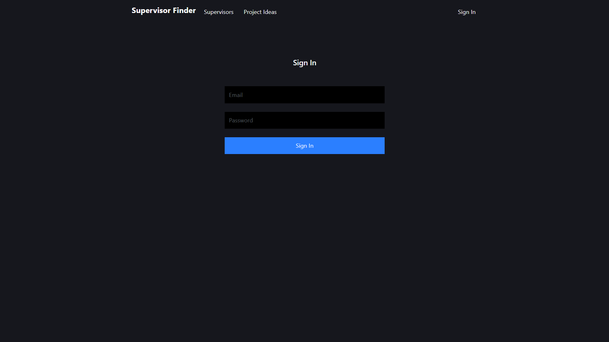
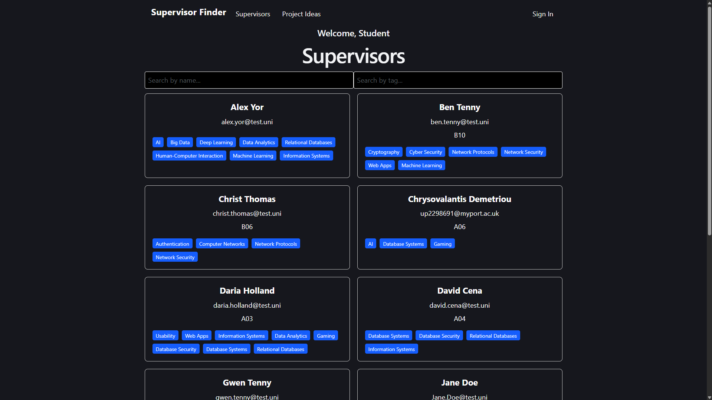
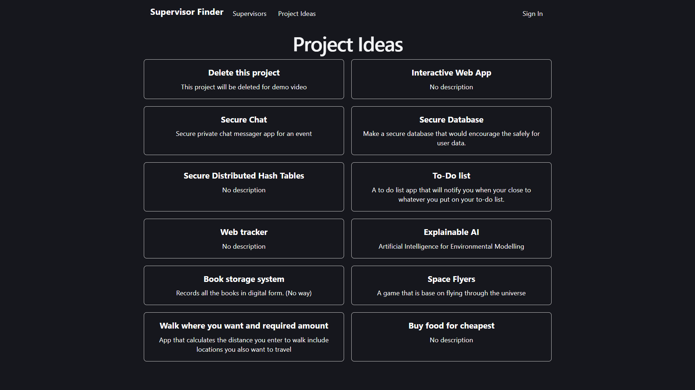
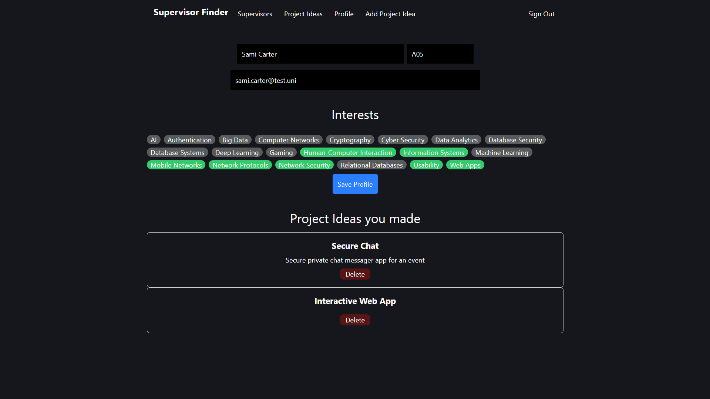
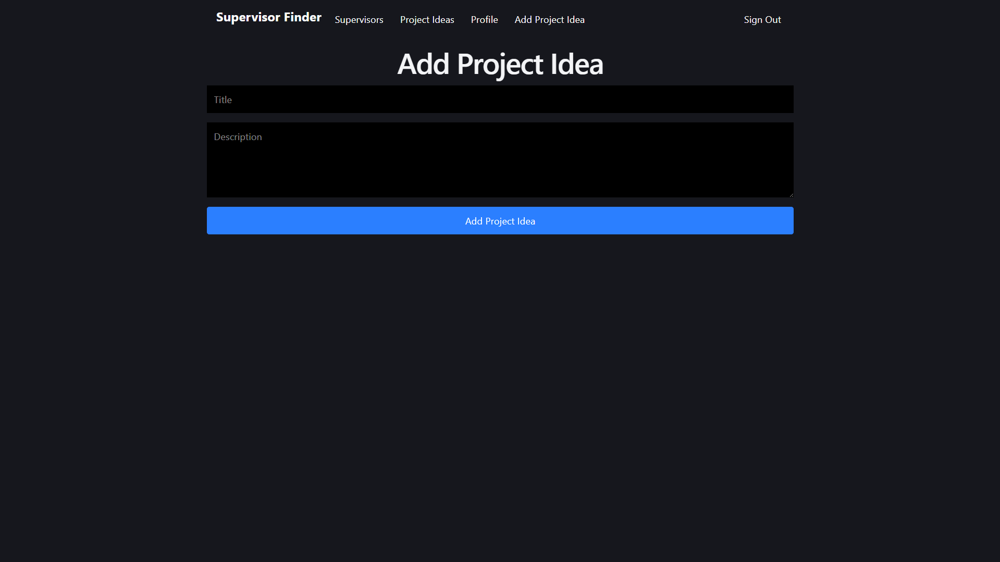

# Supervisor Finder

## Project Description
Supervisor Finder is a Web application built with Supabase, React and tailwind, this was made to help students to find supervisors more easily by searching for the supervisor name or tags of interests they might have. We also made specific pages only for supervisors can see to edit their own profiles or to add project ideas for the final year.

## Features
- **Tags of Interests:**  Search/filter Supervisors base on their interests.
- **Add Project Ideas:** A Supervisor can add ideas for projects.
- **Profile updates** A Supervisor can update their profile.

## Preview Images

### Sign In


### Supervisor


### Project Ideas


### Profile


### Add Project Idea


## Documentation
ReadTheDocs Page: [Link]()

## Installation & Project Setup

1. Clone the responsitory

    ```bash
   git clone https://github.com/TenkaTosic/Deferral_supervisor_finder.git
   ```
   ```bash
   cd Deferral_supervisor_finder
   ```

2. Install dependencies

   ```bash
   npm install
   ```

   ```bash
   npm install React
   ```

Download Vite following: [Link](https://tailwindcss.com/docs/installation/using-vite)

3. Start the app

    ```bash
   npm run dev
   ```